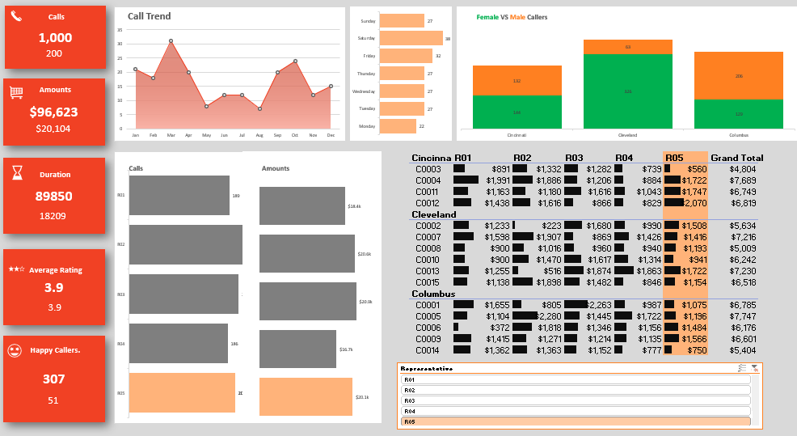

# 📊 Call Center Performance Dashboard (Excel-Based)

This project is a **dynamic and interactive Excel dashboard** built to analyze call center performance data. It showcases advanced Excel techniques, including data cleaning, automation, pivot tables, DAX formulas, Power Query, and interactive visualizations.

---

## 📌 Project Highlights

- Built using **Microsoft Excel** (with Power Query and Power Pivot)
- Analyzes **call center data**: calls made, call duration, amounts generated, customer ratings, and gender-based statistics
- Provides **visual insights** into performance by region, representative, time, and more

---

## 📈 Key Features

- 📥 **Web Scraping & Data Importing**
- 🧹 **Data Cleaning & Automation using Power Query**
- 📊 **Pivot Tables & Pivot Charts**
- ⚙️ **Interactive Filters with Slicers and Timelines**
- 🧮 **Excel Formulas & Functions**:  
  - `COUNTIFS`, `SUMIFS`, `AVERAGEIFS`, `XLOOKUP`, `IFERROR`, `INDEX`, `SMALL`, `LARGE`, `SORT`, `UNIQUE`
- 📐 **Conditional Formatting for Smart Visual Cues**
- 🧠 **Statistical Insights**: Happy callers, call trends, average rating, gender-based analysis
- 💬 **Dynamic Charts and Tables by Region and Representative**

---

## 🛠 Tools & Technologies

- Microsoft Excel (Power Query, Power Pivot)
- Excel Functions & Formulas
- DAX for Excel
- Chart Customization
- Interactive Pivot Charts & Dashboards

---

## 🔍 Use Case

Ideal for **Call Center Managers**, **Business Analysts**, or **Operations Teams** to:

- Track performance by agent or region
- Monitor customer satisfaction metrics
- Identify call volume trends and peak days
- Understand gender-based engagement

---

## 🖼️ Screenshots

> Include images like the one below in your repo to show your work  
> Example:  
> `dashboard-preview.png` (screenshot of your dashboard)
